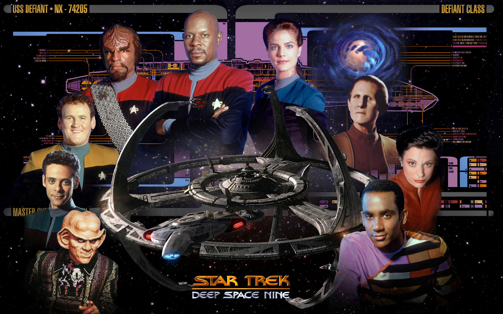

# DS9 — Let's Build an LLM

A ground-up LLM build: character-level transformer trained on DS9 scripts to understand attention and sequence modeling from first principles.



---

## What is this?

In 2017, a team at Google published "Attention Is All You Need." The transformer was born. And it changed everything.

This series builds a character-level language model from scratch, trained on Star Trek: Deep Space Nine scripts, that generates new scenes. By the end, you'll understand how transformers actually work — not from reading about them, but from building one.

---

## What you'll build

A single file — `ds9_transformer.py` — that:

1. Downloads DS9 scripts automatically
2. Trains a small decoder-only transformer
3. Generates new scenes in the style of Deep Space Nine

---

## Syllabus

- Chapter 01: Introduction (What we're building and why it matters)
- Chapter 02: What Is a Language Model? (A guessing machine — tokens, numbers, predictions)
- Chapter 03: Getting the Data (Scraping DS9 scripts and preparing them for training)
- Chapter 04: The Bigram Model (The simplest possible guesser — one character at a time)
- Chapter 05: Why Bigrams Fail (What happens when context matters and we have none)
- Chapter 06: Self-Attention from Scratch (Teaching the model to look back at what it's already seen)
- Chapter 07: Multi-Head Attention (Looking at the same sequence from multiple angles at once)
- Chapter 08: The Transformer Block (Wiring attention, normalization, and feed-forward into one unit)
- Chapter 09: Stacking + Positional Encoding (Going deeper, and giving the model a sense of order)
- Chapter 10: Training for Real (Loss, gradients, AdamW, and when to stop)
- Chapter 11: Generating Text (Sampling from the model — temperature, randomness, control)
- Chapter 12: Reading the Output (What did it actually learn? Interpreting generated DS9 scenes)
- Chapter 13: Tokenization Done Right (Why characters aren't enough — intro to byte pair encoding)
- Chapter 14: Fine-Tuning (Adapting a trained model with less data and fewer resources)
- Chapter 15: RLHF (Teaching the model what "good output" means using feedback)

---

## Getting started

```bash
git clone https://github.com/louiscollinsjr/ds9-llm-from-zero.git
cd ds9-llm-from-zero
pip install torch requests
python ds9_transformer.py
```

The script downloads the data automatically. No setup beyond Python and PyTorch.

**Recommended hardware:** M1 Mac or any GPU. CPU works too — training is just slower.  
**No GPU?** Use [Kaggle Notebooks](https://www.kaggle.com/code) — free T4 GPU, no setup required.

---

## Following along

This project is being built live, section by section, published on LinkedIn and GitHub.

Each section is written to stand alone — you can read them in order or jump to whatever interests you. The full series is designed for two audiences: people with no AI background, and technical folks who want to see the internals clearly.

---

## Philosophy

This project builds on foundational work — from the researchers who introduced the transformer architecture, to educators like Andrej Karpathy, and the writers of Star Trek: Deep Space Nine whose scripts make the dataset possible.

We start with counting character pairs and work our way up to a full transformer, including fine-tuning. The goal is understanding through construction — learning the mechanics by implementing them.

If you’ve read about transformers but want to truly understand how they work under the hood, this repository is for you.

---

## License

MIT